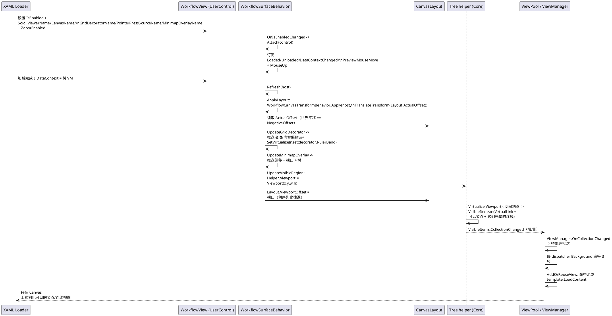
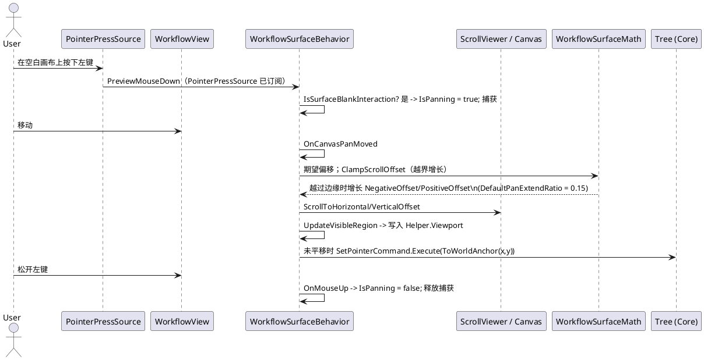
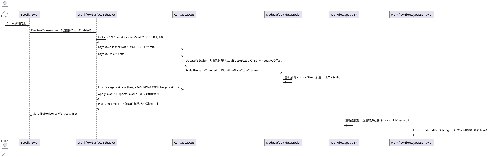
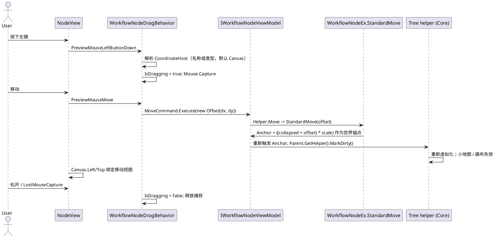
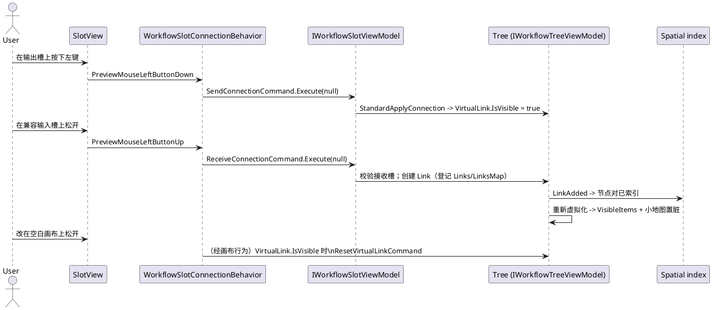
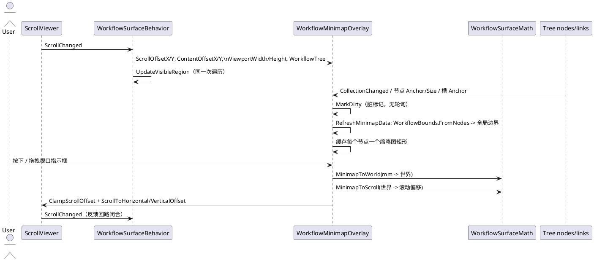

# 08 · 平台适配器 — 数据流分析

下面的时序图追踪平台适配器层的核心数据流。它们以 WPF 适配器源码、Core 模型（`VeloxDev.WorkflowSystem`）以及 WPF/Avalonia/WinUI/MAUI 演示为依据；未经演示覆盖的各平台细节以源码推断并标注 `*推断所得*`。反复出现的关键步骤是可见区域馈送：画布写入 `Helper.Viewport`，空间索引据此重算 `Helper.VisibleItems`，`ViewPool` 只实例化这些视图。WPF/Avalonia/WinUI 演示把 `ViewPool` 绑定到 `Helper.VisibleItems`，MAUI 演示绑定其去链接包装；WinForms 与 Blazor 演示则绑定完整节点集合，把可见区域簿记交给画布自身。

## (a) 附加与布局接线 → 虚拟化 → 池化实例化

## (b) 平移与指针追踪（空白画布）

平移只在按下"空白"画布表面时开始（绝不在节点/槽视觉或滚动条之上）；每次未平移的移动仍会喂给 `SetPointerCommand`。

## (c) 缩放（Ctrl + 鼠标滚轮）

缩放是一个*折叠*因子：画布在滚轮向上时把 `Layout.Scale` 除以 $1/1.1$。节点 `Anchor`/`Size` getter 按该比例朝世界原点折叠，因此缩放移动的是模型几何，而非单个画布变换。

## (d) 节点拖拽 → `MoveCommand` → 世界锚点更新

拖拽行为把坐标宿主空间中的增量转成 `Offset`；`StandardMove` 按当前比例把视图空间增量映射回世界锚点，使节点在缩放状态下也跟随指针。

## (e) 槽连线手势 → 虚拟连线生命周期

连线是对槽的两个命令外加画布上的取消路径。到达合法接收槽时树会注册一条连线；`LinkAdded` 事件触发空间索引与可见集更新。

## (f) 小地图投影与拖拽导航

小地图是实现了 `IWorkflowMinimapOverlay` 的覆盖层元素（WPF `FrameworkElement`、Avalonia `Control`、WinUI `Canvas`、MAUI `GraphicsView`、Jalium `FrameworkElement`、Razor SVG 组件）。画布把滚动/内容偏移、视口尺寸与树推给它；它通过模型事件把自身标记为脏（从不轮询），并渲染整图缩略图外加视口指示框。

