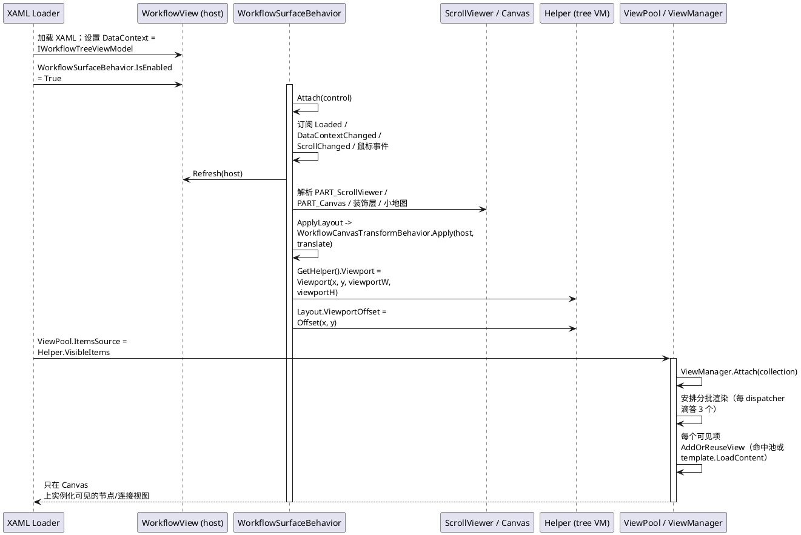
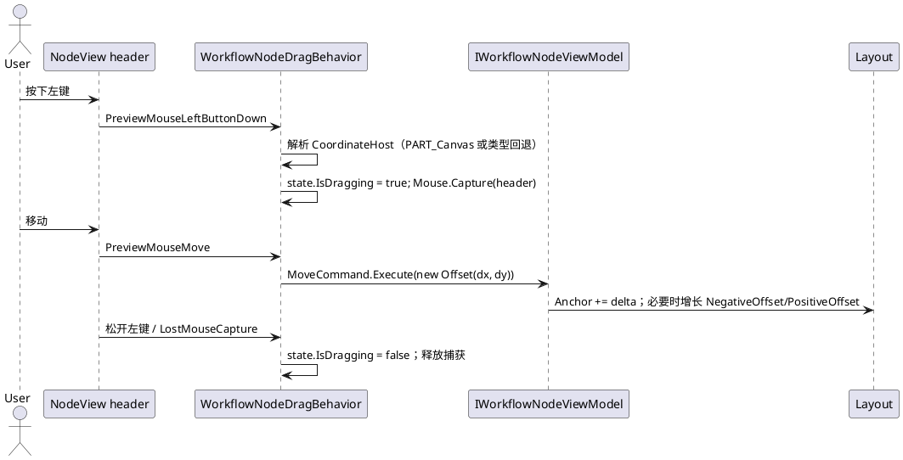
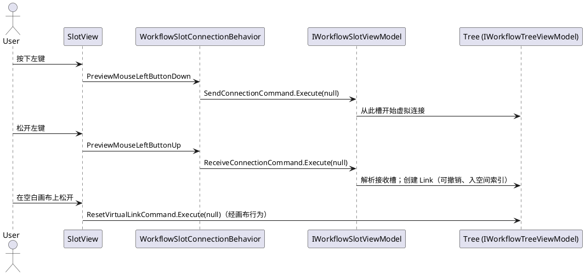
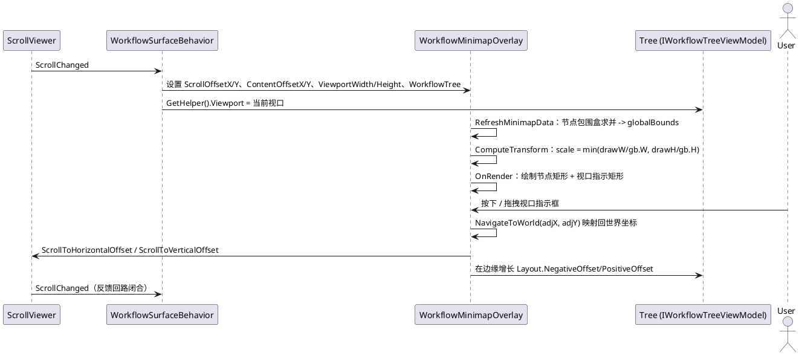
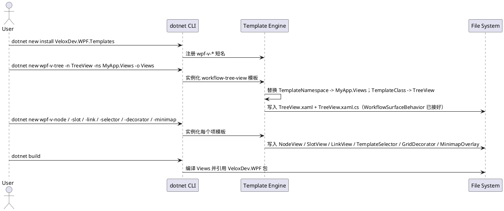

# 08 · 平台适配器 — 数据流分析

下面的时序图追踪平台适配器层的五条核心数据流。它们以 WPF 适配器源码和 WPF/Avalonia/Blazor 演示为依据；未经演示覆盖的各平台细节以源码推断并标注 `*推断所得*`。

## (a) 附加行为接线：XAML 加载 → 行为附加 → 视口 → `ViewPool` 虚拟化

## (b) 拖拽移动：`WorkflowNodeDragBehavior` → `MoveCommand`

## (c) 槽连线：`WorkflowSlotConnectionBehavior` → `SendConnectionCommand` / `ReceiveConnectionCommand`

## (d) 小地图投影流

## (e) 模板脚手架流：`dotnet new` → 生成文件

