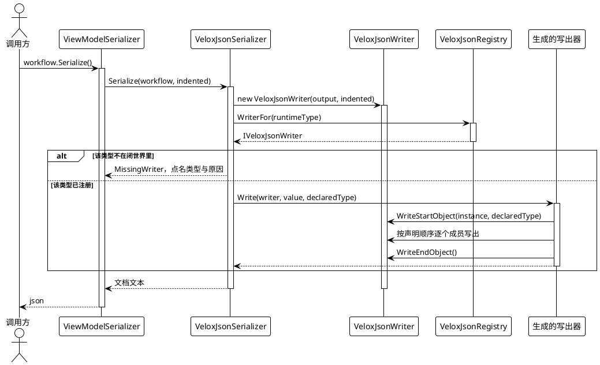
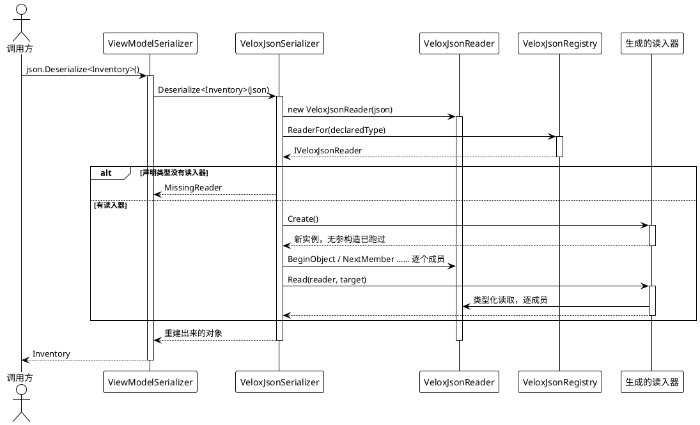

# 数据流分析 — 序列化

归档路径分三段：**解析类型**、**取写出器或读入器**、**遍历成员**。运行期什么都不发现 —— 注册表在程序集加载时就被那些 `[ModuleInitializer]` 填满了。

## 1. 写出文档

格式的身份就落在 `WriteStartObject` 里：某个实例**第一次**出现时写出它的 id，并且**只在运行期类型与声明类型不同时**写出类型标签；再次遇到同一个实例则写一个引用而不是对象（`Src/Core/VeloxDev.Core/Serialization/VeloxJsonWriter.cs:122-142`）。就是这一处分支让带 `Parent` 反向引用的图不会膨胀，也是「为什么不存在 `PreserveReferencesHandling` 那种设置」的答案。

## 2. 读入文档

读侧有三条性质：

- **文档里的成员顺序无所谓。** `NextMember()` 前进，`MemberNameEquals(name)` 就地比对；读入器只问它认识的成员，其余跳过。这也解释了为什么文档里没有的成员会**保持构造函数留下的值** —— 这里没有一趟「恢复默认值」。
- **先跑构造函数，再把成员写上去。** 构造函数设过、而文档没提到的任何东西都会在加载后存活。
- **类型标签经同一张注册表解析。** 即 `TypeOf(name) ?? declaredType` —— 而一旦退回声明类型，具体类会**静默丢掉多态**，接口或抽象类型则抛 `MissingReader`。

## 3. 两条链在哪里分开

读写各自存在**两份** —— 一条同步链、一条异步链 —— 而且是两份手写的代码路径，不是一条加了 `await` 的路径。理由是内存内的路径从不做 I/O，为它付异步状态机的代价纯属浪费。

代价是两者必须保持一致，而没有任何结构性力量逼它们一致：拴住它们的是 `ShapeRoundTripTests.TheTwoChains_SpellEveryScalarTheSameWay` 与 `ElementScalarRoundTripTests`。两条链都漂过 —— 同步写出器漏过 `byte[]`，异步读入器漏过 `byte[]` 与 `DateTimeKind.RoundtripKind`。

生成器为每个类型同时产出两半（`IVeloxJsonWriter` / `IVeloxJsonReader` 各自声明一同步一异步），所以不存在「只支持一半」的类型。
