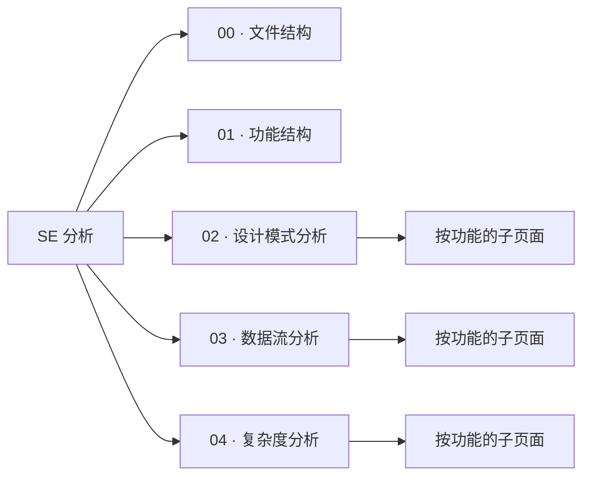

# 软件工程分析

对 VeloxDev 代码库的严谨工程分析，组织为五个页面分组。`01_功能结构` 之后的每个页面分组都按功能（来自功能清单）拆分子页面，使每个功能都有专属分析。

| 页面分组 | 内容 |
|---|---|
| [00 文件结构](00_文件结构) | 仓库布局、目录树、项目到文件夹映射 |
| [01 功能结构](01_功能结构) | 模块职责边界、功能到项目映射、入口点 |
| [02 设计模式分析](02_设计模式分析) | 每个功能的设计模式分析（Mermaid 类图） |
| [03 数据流分析](03_数据流分析) | 每个功能的 API 调用链时序图（PlantUML） |
| [04 复杂度分析](04_复杂度分析) | 每个功能核心操作的时间/空间复杂度（KaTeX） |

功能集合在功能清单中定义，并与 `1_快速开始` 与 `2_API` 两个维度保持一致。
