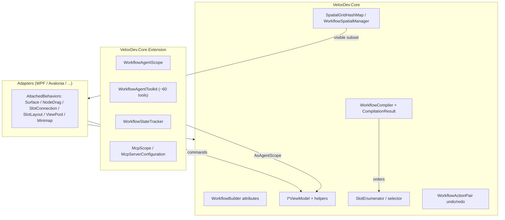

# 功能地图 — 工作流系统

## 职责边界

工作流系统分为三层：

1. **核心（`VeloxDev.Core`）** —— 拥有组件模型（Tree / Node / Slot / Link）、源生成器属性、撤销/重做、空间索引、选择器系统和编译管道。与 UI 框架无关。
2. **适配器（`VeloxDev.WPF`、`VeloxDev.Avalonia`、……）** —— 附加行为（`WorkflowSurfaceBehavior`、`WorkflowNodeDragBehavior`、`WorkflowSlotConnectionBehavior`、`WorkflowSlotLayoutBehavior`、`ViewPool`、`WorkflowMinimapOverlay`）渲染并虚拟化图。
3. **AI / Agent（`VeloxDev.Core.Extension`）** —— `WorkflowAgentScope`（流式上下文与工具）、`WorkflowAgentToolkit`（约 60 个工具）、`WorkflowStateTracker` 与 MCP 加载器（`McpScope`）。

## 功能 → 项目 → 依赖表

| 功能 | 命名空间 | 项目 | 依赖 |
|---|---|---|---|
| 构建器属性 | `VeloxDev.WorkflowSystem` | Core | `VeloxDev.MVVM` |
| 组件接口 | `VeloxDev.WorkflowSystem` | Core | `VeloxDev.AI`（元数据）、`VeloxDev.MVVM` |
| 默认 VM + Helper | `VeloxDev.WorkflowSystem` | Core | StandardEx |
| 值类型 / 枚举 | `VeloxDev.WorkflowSystem` | Core | `VeloxDev.TransitionSystem`（Anchor） |
| 撤销 / 重做 | `VeloxDev.WorkflowSystem.StandardEx` | Core | `WorkflowActionPair` |
| 空间索引 | `VeloxDev.WorkflowSystem` | Core | `ISpatialMap<T>`、`ISpatialBoundsProvider` |
| 选择器 | `VeloxDev.WorkflowSystem` | Core | `ISlotProvider`、`[SlotSelectors]` |
| 编译器 | `VeloxDev.WorkflowSystem.Compilation` | Core | `ICompileTimeRouter`、`ICompileTimePriority`、`ICompileTimeSink` |
| Agent 作用域 + 工具集 | `VeloxDev.AI.Workflow` / `.Functions` | Core.Extension | Core + `Microsoft.Extensions.AI` |
| MCP | `VeloxDev.AI.MCP` | Core.Extension | `ModelContextProtocol.Client`、`CliWrap` |
| 序列化 | `VeloxDev.MVVM.Serialization` | Core.Extension | Newtonsoft.Json |
| 附加行为 | `VeloxDev.WorkflowSystem.AttachedBehaviors` | 适配器 | Core |

## 入口点

| 场景 | 入口点 |
|---|---|
| 定义 Tree | `[WorkflowBuilder.Tree<THelper>]` + `InitializeWorkflow()` |
| 定义 Node | `[WorkflowBuilder.Node<THelper>(workSemaphore: n)]` |
| 构建图 | `tree.GetHelper().CreateNode(node)` → `SendConnection` / `ReceiveConnection` |
| 撤销 / 重做 | `tree.UndoCommand` / `tree.RedoCommand` |
| 编译与执行 | `new WorkflowCompiler().Compile(start, ...)` → `CompilationResult.ExecuteAsync(parameter, ct)` |
| 虚拟化 | `TreeHelper(cellSize)` → `tree.EnableMap(cellSize, VisibleItems)` → `Virtualize(viewport)` |
| 分支路由 | `ICompileTimeRouter.GetRouteTable()` / `SlotEnumerator.SetSelector(type)` |
| 让 AI 驱动 | `tree.AsAgentScope().With...().ProvideProgressiveContextPrompt()` + `ProvideTools()` |
| 持久化 | `tree.Serialize()` / `json.Deserialize<T>()` |

## 关键文件

| 关注点 | 文件 |
|---|---|
| 属性 | `WorkflowSystem/Templates/WorkflowBuilder.cs` |
| 接口 | `Interfaces/WorkflowSystem/IWorkflow*.cs` |
| 标准行为 | `WorkflowSystem/StandardEx/WorkflowTreeEx.cs`（连接、撤销）、`WorkflowNodeEx.cs`、`WorkflowSlotEx.cs`、`WorkflowLinkEx.cs`、`WorkflowSpatialEx.cs` |
| 默认实现 | `WorkflowSystem/Templates/ViewModels/*.cs`、`Templates/Helpers/*.cs` |
| 空间 | `WorkflowSystem/SpatialGridHashMap.cs`、`WorkflowSpatialManager.cs`、`NodeBoundsProvider.cs`、`NodePairBoundsProvider.cs` |
| 选择器 | `WorkflowSystem/SelectorEx/SlotEnumerator.cs`、`ConditionalSlot.cs`、`SlotDefinition.cs` |
| 编译 | `WorkflowSystem/Compilation/Compiler.cs`、`Models/CompilationResult.cs`、`Models/CompiledItem.cs`、`Enums/*.cs` |
| Agent | `VeloxDev.Core.Extension/Agent/Workflow/WorkflowAgentScope.cs`、`WorkflowStateTracker.cs`、`Functions/WorkflowAgentToolkit.cs` |
| MCP | `VeloxDev.Core.Extension/Agent/MCP/McpScope.cs`、`McpServerConfiguration.cs`、`McpServerRunMode.cs` |
| 序列化 | `VeloxDev.Core.Extension/ComponentModelEx.cs` |
| 演示证据 | `Examples/Workflow/Common/Lib/ViewModels/Workflow/**`、`Examples/Workflow/WPF/Demo/Views/Workflow/**` |
