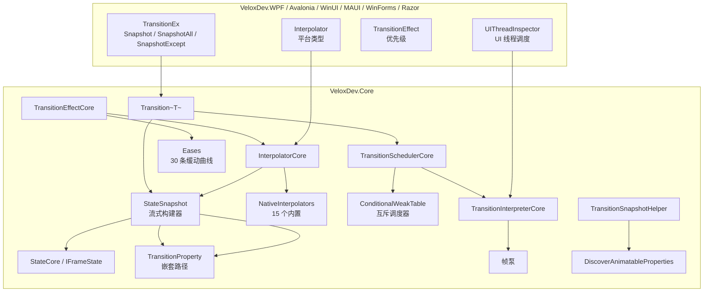

# 功能地图 — 过渡动画系统

## 职责边界

过渡动画系统是**跨平台、代码驱动的插值动画引擎**。核心理念是*「一切皆状态」*：动画是一个描述目标属性值的*状态快照*；引擎把每个记录的属性从当前值插值到目标值，经过一条定时、带缓动、按帧的时间线。它横跨核心引擎（`VeloxDev.Core`）与各平台适配器。

## 功能 → 项目 → 依赖映射

| 功能 | 所属项目 | 公共 API 面 | 依赖 | 证据 |
|---|---|---|---|---|
| 流式动画 API | `VeloxDev.Core` | `Transition<T>.StateSnapshot`（`Property`/`Effect`/`Await`/`Then`/`AwaitThen`/`Execute`） | — | Demo |
| 状态模型 | `VeloxDev.Core` | `StateCore`、`IFrameState`、`TransitionProperty`、`ITransitionProperty` | `System.Reflection` | Demo + Test |
| 插值注册表 | `VeloxDev.Core` | `InterpolatorCore`（`Register/TryGet/Unregister`）、`IValueInterpolator`、`IInterpolable` | — | Demo |
| 原生插值器 | `VeloxDev.Core` | `VeloxDev.TransitionSystem.NativeInterpolators` 15 个 | `System.Drawing`、`System.Numerics` | Test |
| 缓动 | `VeloxDev.Core` | `Eases`、`IEaseCalculator` | — | Demo |
| 效果模型 | `VeloxDev.Core` | `TransitionEffectCore`、`ITransitionEffectCore`、`TransitionEventArgs` | `WeakTypes.WeakDelegate` | Demo |
| 调度器 | `VeloxDev.Core` | `TransitionSchedulerCore`（`FindOrCreate`、`Execute`、`Exit`） | `ConditionalWeakTable` | Test |
| 解释器（帧泵） | `VeloxDev.Core` | `TransitionInterpreterCore`、`ITransitionInterpreterCore` | `TimeLine` 事件 | Test |
| 快照捕获 | `VeloxDev.Core` | `TransitionSnapshotHelper`（`CaptureAll`、`CaptureSpecific`、`DiscoverAnimatableProperties`） | `InterpolatorCore` | Demo |
| 平台接线 | 各适配器 | `TransitionEx`、`Transition`、`Interpolator`、`TransitionEffect`、`TransitionEffects`、`UIThreadInspector` | `VeloxDev.Core` | Demo |

## 入口点

| 入口 | 签名 | 用途 |
|---|---|---|
| `Transition<T>.Create()` | `StateSnapshot Create()` | 构建动画定义 |
| `.Property(...)` / `.Effect(...)` | 流式 | 记录目标值 + 时序/缓动 |
| `.Execute(target, CanMutualTask)` | `void Execute(T target, bool CanMutualTask = true)` | 运行动画（可在后台线程调用） |
| `target.Snapshot(All/Except)` | `Transition<T>.StateSnapshot` | 捕获对象当前值 |
| `Transition.Exit(target, ...)` | `static void Exit<T>(T, bool IncludeMutual, bool IncludeNoMutual)` | 停止运行中的动画 |
| `UIThreadInspector.SetWindow/CaptureUIThread` | 平台 | WinUI / WinForms / Razor 需要的接线 |

## 关键文件

| 文件 | 职责 |
|---|---|
| `Src/Core/VeloxDev.Core/TransitionSystem/Transition.cs` | 入口 `Transition<T>`、`Exit`、`Execute` |
| `Src/Core/VeloxDev.Core/TransitionSystem/StateSnapshot.cs` | 流式构建器 + 分段链接 |
| `Src/Core/VeloxDev.Core/TransitionSystem/State.cs` | `IFrameState` 实现 |
| `Src/Core/VeloxDev.Core/TransitionSystem/Interpolator.cs` | 插值器注册表 + 解析顺序 |
| `Src/Core/VeloxDev.Core/TransitionSystem/TransitionScheduler.cs` | 互斥/非互斥调度器 |
| `Src/Core/VeloxDev.Core/TransitionSystem/TransitionInterpreter.cs` | 帧泵 + 自动往返/循环 |
| `Src/Core/VeloxDev.Core/TransitionSystem/TransitionProperty.cs` | 嵌套属性路径解析 |
| `Src/Core/VeloxDev.Core/TransitionSystem/TransitionSnapshotHelper.cs` | 状态捕获 |
| `Src/Core/VeloxDev.Core/TransitionSystem/NativeInterpolators/*.cs` | 内置值插值器 |
| `Src/Adapters/VeloxDev.{WPF,...}/PlatformAdapters/*.cs` | 各平台 `Interpolator`、`TransitionEffect`、`UIThreadInspector` |
