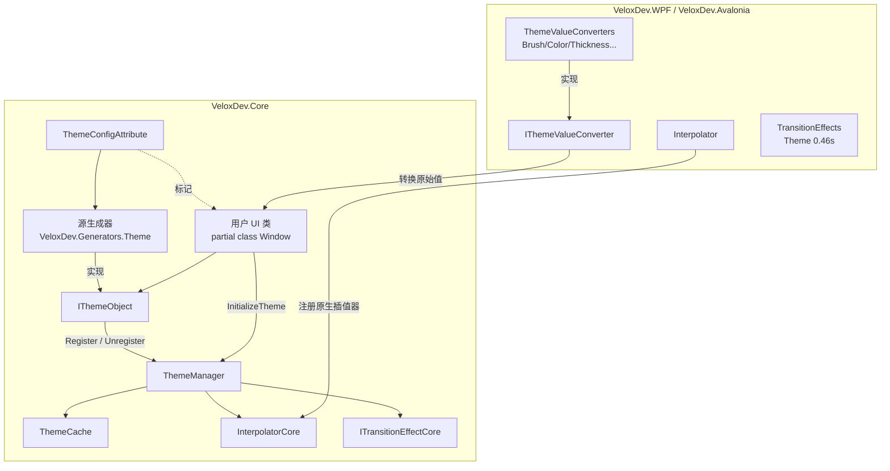

# 功能地图 — 动态主题

## 职责边界

动态主题功能提供**带动画过渡的运行时主题切换**，工作于「属性值」层面。它不替换 `ResourceDictionary`；每个主题感知类为每个属性声明其在不同主题下的取值，主题切换时 `ThemeManager` 对这些属性值进行动画插值。

## 功能 → 项目 → 依赖映射

| 功能 | 所属项目 | 公共 API 面 | 依赖 | 证据 |
|---|---|---|---|---|
| 主题声明 | `VeloxDev.Core` | `ThemeConfigAttribute<TConv, TTheme...>`、`ITheme`、`Dark`、`Light` | `VeloxDev.Core.Generator` | Demo |
| 主题编排 | `VeloxDev.Core` | `ThemeManager`（静态）、`ThemeCache`、`StartModel`、`IThemeObject`、`IThemeValueConverter` | `VeloxDev.TransitionSystem`（核心） | Demo + Test |
| 生成 `IThemeObject` | `VeloxDev.Core.Generator` | `InitializeTheme`、`SetThemeValue<T>`、`RestoreThemeValue<T>`、`GetStaticThemeCache`、`GetActiveThemeCache` | `Microsoft.CodeAnalysis.CSharp` | Demo |
| 插值引擎 | `VeloxDev.Core` | `InterpolatorCore`、`ITransitionEffectCore`、`Eases`、`IValueInterpolator` | — | Demo |
| 平台值转换器 | `VeloxDev.WPF` / `VeloxDev.Avalonia` | `BrushConverter`、`ColorConverter`、`ThicknessConverter`、`DoubleConverter`、`PointConverter`、`CornerRadiusConverter`、`ObjectConverter` | `VeloxDev.Core` | Demo |
| 平台插值器 | `VeloxDev.WPF` / `VeloxDev.Avalonia` | `Interpolator`、`TransitionEffect`、`TransitionEffects` | `VeloxDev.Core` | Demo |

## 入口点

| 入口 | 签名 | 用途 |
|---|---|---|
| `ThemeManager.Transition<T>` | `void Transition<T>(ITransitionEffectCore effect) where T : ITheme` | 带动画切换主题 |
| `ThemeManager.Jump<T>` | `void Jump<T>() where T : ITheme` | 无动画立即切换 |
| `ThemeManager.SetPlatformInterpolator` | `void SetPlatformInterpolator<T>(T) where T : InterpolatorCore` | 安装适配器插值器（一次） |
| `InitializeTheme()` | 生成成员 | 注册实例 + 应用当前主题 |
| `SetThemeValue<T>` | `void SetThemeValue<T>(string, object?) where T : ITheme` | 运行时按实例覆盖 |

## 关键文件

| 文件 | 职责 |
|---|---|
| `Src/Core/VeloxDev.Core/DynamicTheme/ThemeManager.cs` | 编排：`Transition`、`Jump`、`Register`、`CalculateFrames`、`ExecuteTransition` |
| `Src/Core/VeloxDev.Core/DynamicTheme/ThemeCache.cs` | 静态默认值 + 按实例覆盖 |
| `Src/Core/VeloxDev.Core/DynamicTheme/ThemeConfigAttribute.cs` | 声明特性（源生成器输入） |
| `Src/Generators/VeloxDev.Core.Generator/Theme.cs` | 生成 `IThemeObject` 的 Roslyn 增量生成器 |
| `Src/Core/VeloxDev.Core/TransitionSystem/{Interpolator,TransitionEffect,Eases}.cs` | 插值 + 缓动引擎 |
| `Src/Adapters/VeloxDev.WPF/PlatformAdapters/{ThemeValueConverters,Interpolator,TransitionEffect,TransitionEffects}.cs` | WPF 平台接线 |
| `Src/Adapters/VeloxDev.Avalonia/PlatformAdapters/*.cs` | Avalonia 平台接线 |
