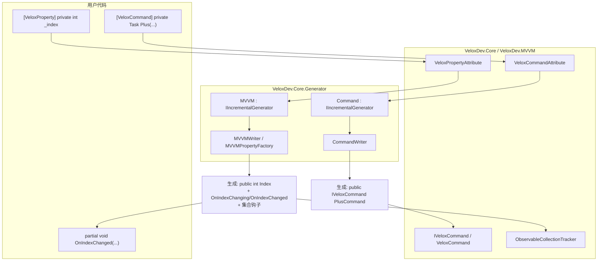

# 功能地图 — MVVM

## 职责边界

MVVM 支持由两部分协作交付：**运行时**类型位于 `VeloxDev.Core`（命名空间 `VeloxDev.MVVM` — 特性、`IVeloxCommand`、`VeloxCommand`、`ObservableCollectionTracker`），**源生成器**位于独立程序集 `VeloxDev.Core.Generator`（命名空间 `VeloxDev.Generators`，生成器 `MVVM` 与 `Command`）。用户只需要编写带特性的 `partial` 类与 `partial void` 钩子，其余一切在编译期产出。

## 功能 → 项目 → 依赖映射

| 功能 | 所属项目 | 公开 API 面 | 依赖 | 证据 |
|---|---|---|---|---|
| 可观察属性生成 | `VeloxDev.Core.Generator` | `[VeloxProperty]`、生成的 `INotifyPropertyChanging/Changed` 属性、`OnXxxChanging/Changed` 分部方法 | `VeloxDev.Core`（特性） | Demo |
| 集合追踪 | `VeloxDev.Core` | `ObservableCollectionTracker`（`EnsureSubscribed`/`Unsubscribe`）；生成的 `OnCollectionChanged<T>`、`OnItemAddedToXxx`/`OnItemRemovedFromXxx`/`OnItemMovedInXxx`/`OnItemsResetInXxx` | `System.Collections.Specialized`、`ConditionalWeakTable` | Demo |
| 命令生成 | `VeloxDev.Core.Generator` | `[VeloxCommand]`、生成的 `IVeloxCommand` 属性、`CanExecuteXxxCommand` 分部方法 | `VeloxDev.Core`（特性、运行时） | Demo |
| 命令运行时 | `VeloxDev.Core` | `IVeloxCommand`、`VeloxCommand`、`CommandEventType`、`CommandEventArgs`、`CommandEventHandler` | `ICommand`、`SemaphoreSlim`、`Queue<>` | Demo + Test |
| 宿主框架检测 | `VeloxDev.Core.Generator` | `DetectSetterMode` → 委托给 CommunityToolkit.Mvvm / Prism / ReactiveUI / Caliburn.Micro | Roslyn | *依据 MVVMWriter.cs 推断* |

## 入口点

| 入口点 | 签名 | 用途 |
|---|---|---|
| `[VeloxProperty] private T _field;` | 标记字段 / partial 属性 | 声明可观察属性 |
| `partial void OnXxxChanged(T old, T new);` | 分部方法 | 响应属性变化 |
| `[VeloxCommand] private Task Foo(...)` | 标记方法 | 声明命令（`FooCommand`） |
| `private partial bool CanExecuteFooCommand(object? parameter);` | 分部方法 | 控制命令的可执行性 |
| `IVeloxCommand.Execute / ExecuteAsync(object?)` | 运行时 | 触发 / 等待命令 |
| `IVeloxCommand.Notify()` | 运行时 | 重新查询 `CanExecute` 并触发 `CanExecuteChanged` |
| `ObservableCollectionTracker.EnsureSubscribed` | 运行时（由生成的 getter 调用） | 保持集合订阅有效 |

## 关键文件

| 文件 | 作用 |
|---|---|
| `Src/Core/VeloxDev.Core/MVVM/VeloxPropertyAttribute.cs` | 属性特性 |
| `Src/Core/VeloxDev.Core/MVVM/VeloxCommandAttribute.cs` | 命令特性 |
| `Src/Core/VeloxDev.Core/MVVM/VeloxCommand.cs` | `VeloxCommand`、`CommandEventType`、`CommandEventArgs`、`CommandEventHandler` |
| `Src/Core/VeloxDev.Core/MVVM/ObservableCollectionTracker.cs` | 弱引用集合订阅辅助 |
| `Src/Core/VeloxDev.Core/Interfaces/MVVM/IVeloxCommand.cs` | 命令契约 |
| `Src/Generators/VeloxDev.Core.Generator/MVVM.cs` | `MVVM` 增量生成器 |
| `Src/Generators/VeloxDev.Core.Generator/Command.cs` | `Command` 增量生成器 |
| `Src/Generators/VeloxDev.Core.Generator/Writers/MVVMWriter.cs` | 属性 + 通知基础设施生成 |
| `Src/Generators/VeloxDev.Core.Generator/Writers/CommandWriter.cs` | 命令属性生成 |
| `Src/Generators/VeloxDev.Core.Generator/Base/Analizer.cs` | `MVVMPropertyFactory` — setter/getter/集合体模板 |
| `Src/Core/VeloxDev.Core.Test/MVVM/VeloxCommandTests.cs` | 命令运行时测试 |
| `Examples/MVVM/WPF/Demo/MainWindowViewModel.cs` | 参考用法 |
