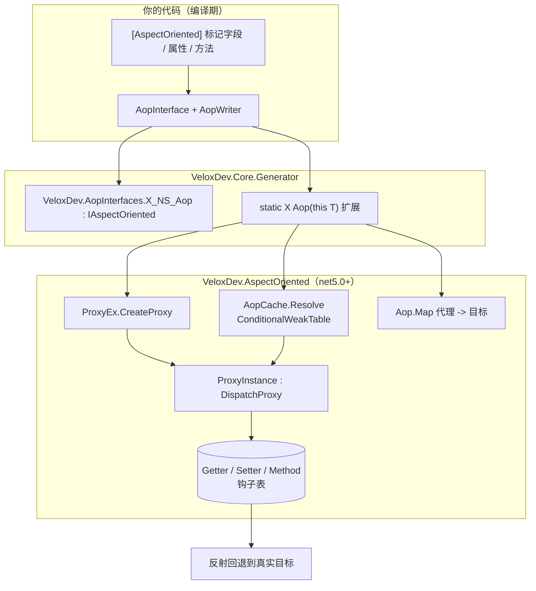
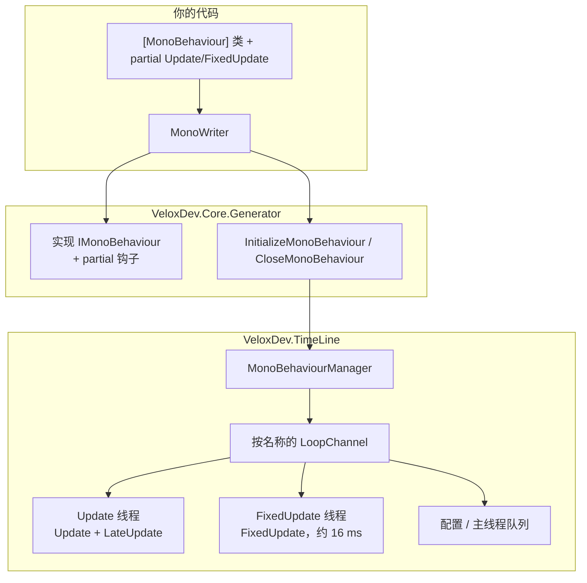
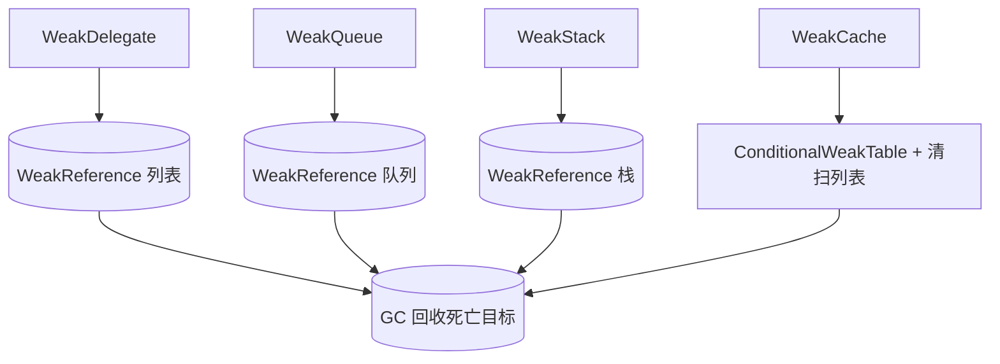

# 功能地图 — AOP、MonoBehaviour 与弱引用

三个特性都位于 `VeloxDev.Core` 程序集（`Src/Core/VeloxDev.Core/`），并依赖编译期源生成器 `VeloxDev.Core.Generator`。AOP 仅限 **net5.0+**（`#if NET`）；MonoBehaviour 与弱引用运行时支持多目标。

## AOP — 流程

## MonoBehaviour — 流程

## 弱引用 — 流程

## 功能 → 工程 → 依赖

| 功能 | 归属工程 | 公开 API | 依赖 | 证据 |
|---|---|---|---|---|
| AOP 特性 + 标记接口 | `VeloxDev.Core` | `AspectOrientedAttribute`, `IAspectOriented` | — | Demo |
| AOP 代理运行时 | `VeloxDev.Core`（`#if NET`） | `ProxyEx.CreateProxy/SetProxy`, `ProxyInstance : DispatchProxy`, `ProxyMembers`, `ProxyHandler` | `System.Reflection.DispatchProxy` | Demo |
| AOP 缓存 + 逆向查找 | `VeloxDev.Core`（`#if NET`） | `AopCache.Resolve`, `Aop.Map/GetTarget` | `ConditionalWeakTable` | Demo |
| AOP 源生成器 | `VeloxDev.Core.Generator` | `AopInterface`, `AopWriter`, `AopProxy` | Roslyn | Demo 构建 |
| MonoBehaviour 特性 | `VeloxDev.Core` | `MonoBehaviourAttribute`（`Channel`, `TargetFPS`） | — | Demo |
| 帧循环管理器 | `VeloxDev.Core` | `MonoBehaviourManager`（生命周期 / 配置 / 查询 / 事件） | `VeloxDev.MonoBehaviour.IMonoBehaviour` | Demo + Test |
| 行为契约 | `VeloxDev.Core` | `IMonoBehaviour`, `FrameEventArgs`, `TimeLineEventArgs`, `ThreadSafeFrameEventArgs`, `TransitionEventArgs`, `MonoBehaviourChannelEventArgs` | `VeloxDev.TimeLine` | Demo + Test |
| MonoBehaviour 源生成器 | `VeloxDev.Core.Generator` | `MonoBehaviour`, `MonoWriter` | Roslyn | Demo 构建 |
| 弱事件包装 | `VeloxDev.Core` | `WeakDelegate<TDelegate>` | `WeakReference<Delegate>` | Test |
| 弱集合 | `VeloxDev.Core` | `WeakQueue<T>`, `WeakStack<T>` | `WeakReference<T>` | Test |
| 弱缓存 | `VeloxDev.Core` | `WeakCache<TTargetKey,TCacheKey>` | `ConditionalWeakTable` | Test |

## 入口点

| 入口 | 签名 | 用途 |
|---|---|---|
| `instance.Aop()` | 生成器扩展 | 获取（或创建）`[AspectOriented]` 类的缓存 AOP 代理 |
| `proxy.SetProxy(...)` | `(ProxyMembers, name, start, coverage, end)` | 附加拦截钩子 |
| `MonoBehaviourManager.Start()` | `void Start(string channel = "default")` | 启动某通道的帧循环 |
| `MonoBehaviourManager.StopAsync()` | `Task StopAsync(string channel = "default")` | 停止循环并汇合线程 |
| `MonoBehaviourManager.RegisterBehaviour(b, channel)` | `void` | 注册行为（`InitializeMonoBehaviour()` 内部也会调用） |
| `new WeakDelegate<Action>()` | 构造函数 | 无泄漏事件订阅 |
| `new WeakQueue<T>()` / `new WeakStack<T>()` | 构造函数 | 弱 FIFO / LIFO 容器 |
| `new WeakCache<K, V>()` | 构造函数 | 带周期性清扫的弱键缓存 |

## 关键文件

| 文件 | 角色 |
|---|---|
| `Src/Core/VeloxDev.Core/AspectOriented/AspectOrientedAttribute.cs` | `[AspectOriented]` 特性 |
| `Src/Core/VeloxDev.Core/AspectOriented/ProxyEx.cs` | `ProxyMembers`, `CreateProxy`, `SetProxy` |
| `Src/Core/VeloxDev.Core/AspectOriented/ProxyInstance.cs` | `DispatchProxy` 拦截器（`Invoke`） |
| `Src/Core/VeloxDev.Core/AspectOriented/Aop.cs` | 代理→目标逆向查找 |
| `Src/Core/VeloxDev.Core/AspectOriented/AopCache.cs` | `ConditionalWeakTable` 代理缓存 |
| `Src/Generators/VeloxDev.Core.Generator/AopInterface.cs` | 生成 `{Class}_{NS}_Aop` 接口 |
| `Src/Generators/VeloxDev.Core.Generator/Writers/AopWriter.cs` | 生成 partial 类 + `Aop()` 扩展 |
| `Src/Core/VeloxDev.Core/TimeLine/MonoBehaviourManager.cs` | 循环通道、线程、查询、事件 |
| `Src/Core/VeloxDev.Core/TimeLine/MonoBehaviourAttribute.cs` | `[MonoBehaviour]` 特性 |
| `Src/Core/VeloxDev.Core/TimeLine/FrameEventArgs.cs` | 每帧载荷 |
| `Src/Generators/VeloxDev.Core.Generator/Writers/MonoWriter.cs` | 生成 `IMonoBehaviour` 桥接 + partial 钩子 |
| `Src/Core/VeloxDev.Core/WeakTypes/WeakDelegate.cs` | 弱事件包装 |
| `Src/Core/VeloxDev.Core/WeakTypes/WeakQueue.cs` / `WeakStack.cs` | 弱 FIFO / LIFO |
| `Src/Core/VeloxDev.Core/WeakTypes/WeakCache.cs` | 弱缓存 + 清扫 |
