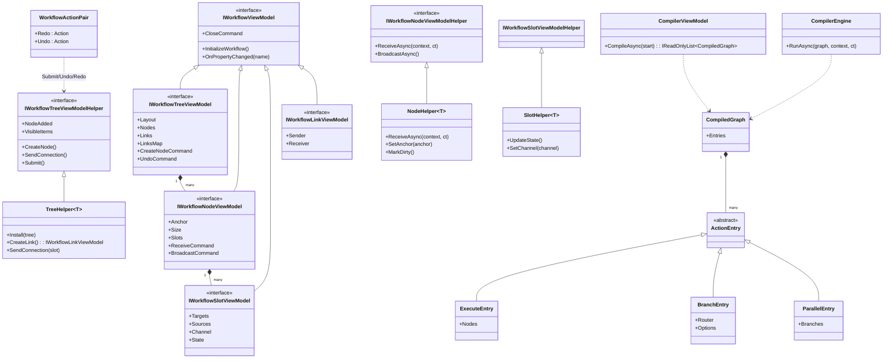

# 设计模式 — 工作流系统

## 类图



## 识别到的模式

### 1. 模板方法 —— Helper

每个组件的 Helper 基类定义生命周期骨架（`Install` → 订阅集合、`Uninstall` → 取消订阅、`Closing/CloseAsync/Closed`）并暴露可覆写的钩子。`TreeHelper<T>` 调用 `base.Install` 后启用虚拟化；`HttpHelper<T>` 覆写 `Install` 订阅 `ReceiveCommand` 事件、`ReceiveAsync` 执行业务逻辑。

> 源码：`Src/Core/VeloxDev.Core/WorkflowSystem/Templates/Helpers/TreeHelper.cs`，第 109-124 行

```csharp
public virtual void Install(IWorkflowTreeViewModel tree)
{
    Component = tree as T;
    commands = tree.GetStandardCommands();
    VisibleItems = [];
    tree.Nodes.CollectionChanged += OnNodesChanged;
    tree.Links.CollectionChanged += OnLinksChanged;

    if (!useVirtualization) return;

    if (Component is null || tree.EnableMap(CellSize, VisibleItems) < 0)
    {
        Debug.Fail("EnableMap did not return a non-negative value as expected...");
    }
    InitializeMonoBehaviour();
}
```

### 2. 命令模式 —— `IVeloxCommand` + 撤销/重做

每个变更都经过命令对象。可撤销操作通过 `StandardSubmit` 把 `WorkflowActionPair(redo, undo)` 提交到撤销栈；`StandardUndo` 弹出并执行 `Undo`，压入重做栈。`StandardCreateNode` 是典型示例：

> 源码：`Src/Core/VeloxDev.Core/WorkflowSystem/StandardEx/WorkflowTreeEx.cs`，第 27-35 与 238-248 行

```csharp
public static void StandardCreateNode(this IWorkflowTreeViewModel component, IWorkflowNodeViewModel node)
{
    var oldParent = node.Parent;
    var newParent = component;
    node.GetHelper().Delete();
    component.StandardSubmit(new WorkflowActionPair(
        () => CreateNodeRedo(component, node, newParent),
        () => CreateNodeUndo(component, node, oldParent)));
}
```

### 3. 观察者模式 —— 集合与命令事件

Helper 观察 `ObservableCollection` 变化和命令生命周期事件。`TreeHelper` 从 `CollectionChanged` 处理器中引发 `NodeAdded/NodeRemoved/LinkAdded/LinkRemoved`；`HttpHelper<T>` 订阅 `ReceiveCommand.Started/Exited/Enqueued/Dequeued` 更新运行时计数器：

> 源码：`Examples/Workflow/Common/Lib/ViewModels/Workflow/Helper/HttpHelper.cs`，第 42-82 行

```csharp
_startedHandler = e => { Interlocked.Increment(ref _activeRuns); ... };
_exitedHandler   = e => { ... if (Interlocked.Decrement(ref _activeRuns) <= 0) StopRuntimeTicker(); };
_viewModel.ReceiveCommand.Started += _startedHandler;
_viewModel.ReceiveCommand.Exited  += _exitedHandler;
```

### 4. 策略模式 —— SlotEnumerator / 选择器 + `ICompileTimeRouter`

`SlotEnumerator<TSlot>` 通过 `SetSelector(type)` 交换输出槽策略。`BoolSelectorNodeViewModel` 与 `EnumSelectorNodeViewModel` 实现 `ICompileTimeRouter`，让编译器预先收集路由表（`GetRouteTable`），`ResolveRouteKey` 决定当前走哪个分支 —— 静态模式编译期锁定、剪枝未选中分支；动态模式运行期重解析：

> 源码：`Examples/Workflow/Common/Lib/ViewModels/Workflow/BoolSelectorNodeViewModel.cs`，第 92-118 行

```csharp
public Task<object?> ResolveRouteKey(object? payload)
{
    if (CompileMode == RouterCompileMode.Dynamic && payload is null)
        return Task.FromResult<object?>(null);
    return Task.FromResult<object?>(Condition);
}

public Task<IReadOnlyDictionary<object, IReadOnlyList<IWorkflowNodeViewModel>>> GetRouteTable()
{
    var dict = new Dictionary<object, List<IWorkflowNodeViewModel>>();
    if (CompileMode == RouterCompileMode.Static)
        AddBranch(dict, Condition, Condition ? TrueSlot : FalseSlot);
    else
    {
        AddBranch(dict, true, TrueSlot);
        AddBranch(dict, false, FalseSlot);
    }
    // ... 无下游的分支登记为终端分支（空列表）
    return Task.FromResult<IReadOnlyDictionary<object, IReadOnlyList<IWorkflowNodeViewModel>>>(
        dict.ToDictionary(kv => kv.Key, kv => (IReadOnlyList<IWorkflowNodeViewModel>)kv.Value.AsReadOnly()));
}
```

### 5. 代理 / 装饰器 —— 源生成的 partial ViewModel

`[WorkflowBuilder.Node<THelper>]` 等把用户的 `partial` 类作为被装饰的表面；生成器产生属性/命令成员，而 Helper（通过 `SetHelper` 注入的独立对象）拥有行为。演示 `BoolSelectorNodeViewModel` / `EnumSelectorNodeViewModel` 在生成命令之外暴露了额外的实例属性作为 ComboBox 数据源（路由模式）：

> 源码：`Examples/Workflow/Common/Lib/ViewModels/Workflow/BoolSelectorNodeViewModel.cs`，第 86 行

```csharp
public RouterCompileMode[] CompileModeOptions => [RouterCompileMode.Static, RouterCompileMode.Dynamic];
```

### 6. 门面 —— `WorkflowBuilder`

`WorkflowBuilder` 的嵌套属性类型（`TreeAttribute<T>`、`NodeAttribute<T>`、`SlotAttribute<T>`、`LinkAttribute<T>`）构成整个组件系统的紧凑门面：一个属性选择 Helper 类型、并发度、虚拟连接类型等，生成器生成其余部分。

### 7. 组合 —— 节点包含槽位

`IWorkflowNodeViewModel.Slots` 拥有 `IWorkflowSlotViewModel` 实例；连接由 `sender.Targets` / `receiver.Sources` 派生，并由 `WorkflowSpatialManager` 以节点对（`NodePairBoundsProvider`）索引：

> 源码：`Src/Core/VeloxDev.Core/WorkflowSystem/WorkflowSpatialManager.cs`，第 142-164 行

```csharp
private void InsertLink(IWorkflowLinkViewModel link)
{
    if (link == null || _nodePairProviders.ContainsKey(link)) return;
    if (link.Sender?.Parent is IWorkflowNodeViewModel nodeA &&
        link.Receiver?.Parent is IWorkflowNodeViewModel nodeB &&
        nodeA != nodeB &&
        _nodeProviders.TryGetValue(nodeA, out var providerA) &&
        _nodeProviders.TryGetValue(nodeB, out var providerB))
    {
        var pairProvider = new NodePairBoundsProvider(nodeA, nodeB, providerA, providerB);
        _nodePairProviders[link] = pairProvider;
        _pairToLink[pairProvider] = link;
        _nodePairMap.Insert(pairProvider);
        AddToNodeIndex(nodeA, pairProvider);
        AddToNodeIndex(nodeB, pairProvider);
    }
}
```

### 8. 虚拟代理 —— `ViewPool` + 空间虚拟化

`WorkflowSpatialEx.Virtualize` 查询空间映射并原地调整 `VisibleItems`，使 UI 只渲染与视口相交的项目（外加一层的连接）。可重入由每个树的标志守卫：

> 源码：`Src/Core/VeloxDev.Core/WorkflowSystem/StandardEx/WorkflowSpatialEx.cs`，第 93-111 行

```csharp
public static void Virtualize(this IWorkflowTreeViewModel tree, Viewport viewport)
{
    if (viewport.Width <= 0 || viewport.Height <= 0) return;
    if (!Virtualizing.TryAdd(tree, 0)) return;
    try { VirtualizeCore(tree, viewport); }
    finally { Virtualizing.TryRemove(tree, out _); }
}
```

### 9. 构建者 —— 流式 `WorkflowAgentScope`

`tree.AsAgentScope().WithPromptLanguage(...).WithAutoDiscovery(...).WithMaxToolCalls(...)` 链式配置，最终物化为提示词与工具（`ProvideProgressiveContextPrompt()`、`ProvideTools()`）：

> 源码：`Examples/Workflow/Common/Lib/ViewModels/Workflow/Helper/AgentHelper.cs`，第 86-121 行

```csharp
var scope = tree.AsAgentScope()
    .WithPromptLanguage(AgentLanguages.English)
    .WithOutputLanguage(AgentLanguages.Chinese)
    .WithAutoDiscovery(assemblyName: "VeloxDev.Core")
    .WithAutoDiscovery(assemblyName: "Lib")
    .WithMaxToolCalls(200)
    .WithToolCallCallback(args => { helper.ToolCalled?.Invoke(); return Task.CompletedTask; });
var contextPrompt = scope.ProvideProgressiveContextPrompt();
var tools = scope.ProvideTools();
```
