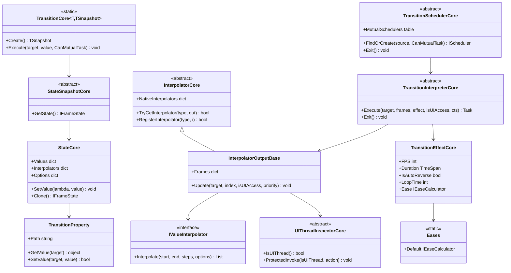

# 设计模式 — 过渡动画系统



## 识别到的模式

### 1. 流式构建器模式（`StateSnapshot`）

`Transition<T>.Create()` 返回 `StateSnapshot` 流式构建器。`.Property(lambda, value)`、`.Effect(...)`、`.Await(...)`、`.AwaitThen(...)`、`.Then()` 每个都返回同一快照供链式调用；`.Execute(target, CanMutualTask)` 消费它。

```csharp
// Examples/Transition/WPF/Demo/MainWindow.xaml.cs（第 80-90 行）
private static readonly Transition<Rectangle>.StateSnapshot Animation0 =
    Transition<Rectangle>.Create()
        .Property(r => r.Opacity, 0)
        .Property(r => ((TranslateTransform)r.RenderTransform).X, 800)
        .Property(r => r.Fill, new SolidColorBrush(Colors.Orange))
        .Effect(new TransitionEffect()
        {
            Duration = TimeSpan.FromSeconds(2),
            IsAutoReverse = true,
            LoopTime = 2,
        });
```

### 2. 注册表模式（`InterpolatorCore`）

全局 `ConcurrentDictionary<Type, IValueInterpolator>`（`NativeInterpolators`）加 `RegisterInterpolator`/`TryGetInterpolator`/`UnregisterInterpolator`。解析顺序：按属性自定义插值器 → 注册表 → 起始/结束值上的 `IInterpolable`。

### 3. 策略模式（缓动 + 插值器）

`IEaseCalculator.Ease(double t)` 策略来自 `Eases.*`（`Sine`、`Quad`、`Bounce`...）。`IValueInterpolator.Interpolate(...)` 策略将值类型映射为帧列表（如 `ColorInterpolator`、`QuaternionInterpolator`）。缓动通过**重新索引**预计算帧数组（`GetEaseIndex` 把缓动后的 `t` 映射为帧索引）实现，而非每帧重新求值。

### 4. 模板方法模式（核心引擎）

核心类（6/7 泛型元数的 `StateSnapshotCore`、`InterpolatorCore<T>`、`TransitionSchedulerCore<T>`、`TransitionInterpreterCore<T>`、`InterpolatorOutputCore<T>`、`UIThreadInspectorCore<T>`）定义算法骨架；每个**适配器**为其平台提供具体子类（`TransitionEffect` 优先级、`Interpolator` 注册、`UIThreadInspector` 调度）。

### 5. 代理 / 适配器模式（平台适配器）

`UIThreadInspector` 包装各平台的分发器（`Application.Current.Dispatcher`、`Dispatcher.UIThread`、`DispatcherQueue.TryEnqueue`、`SynchronizationContext.Post`），使引擎可在任意线程启动动画并把帧写回 UI 线程。

### 6. 单例 + `ConditionalWeakTable` 缓存（调度器）

`TransitionSchedulerCore.MutualSchedulers` 是 `ConditionalWeakTable<object, ITransitionSchedulerCore>` —— 每个目标一个共享互斥调度器，随目标一起被 GC 回收（无泄漏）。`FindOrCreate(source, CanMutualTask)` 返回它，或在并行动画时返回一次性非互斥调度器。

### 7. 组合（状态分段）

`.AwaitThen(...)` 把快照链接成**分段链表**，每段有独立的 `State` + `Effect`；解释器按顺序播放，尊重每段的延迟、缓动与循环设置。

### 8. 观察者模式（效果生命周期事件）

`TransitionEffectCore` 暴露 `Awaked/Start/Update/LateUpdate/Canceled/Completed/Finally` 事件，由 `WeakDelegate`（无泄漏）支撑；`TransitionInterpreterCore` 在每帧与完成/取消时触发它们。

> 源码引用：`Src/Core/VeloxDev.Core/TransitionSystem/*.cs`、`Src/Adapters/VeloxDev.{WPF,...}/PlatformAdapters/*.cs`、`Examples/Transition/WPF/Demo/MainWindow.xaml.cs`。
