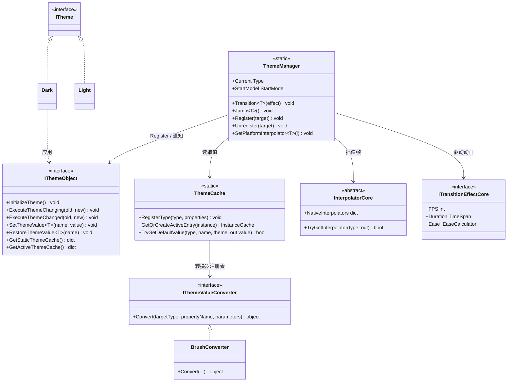

# 设计模式 — 动态主题

动态主题功能将「声明式配置（源生成）」「运行时注册表」与「基于策略的插值引擎」三者结合。



## 识别到的模式

### 1. 外观模式（ThemeManager）

`ThemeManager` 是覆盖 `ThemeCache`（存储）、`InterpolatorCore`（动画）与 `IThemeObject` 注册表之上的静态外观。调用者只需看到 `Transition<T>` / `Jump<T>` / `SetPlatformInterpolator`。

### 2. 观察者模式（主题变更通知）

`ThemeManager.Transition(Type, effect)` 遍历所有已注册的 `IThemeObject`，在动画前调用 `ExecuteThemeChanging(old, new)`，在动画后调用 `ExecuteThemeChanged(old, new)`。生成实现转发给用户的 `partial void OnThemeChanging` / `partial void OnThemeChanged`。

```csharp
// Src/Core/VeloxDev.Core/DynamicTheme/ThemeManager.cs (Transition)
foreach (var themeObject in actives)
    themeObject?.ExecuteThemeChanging(current, themeType);
await ExecuteTransition(CalculateFrames(...), deltaTime, themeType);
foreach (var themeObject in actives)
    themeObject?.ExecuteThemeChanged(current, themeType);
```

### 3. 模板方法模式（源生成的 IThemeObject）

`IThemeObject.InitializeTheme()` 是固定算法（在 `ThemeCache` 注册类型 → `ThemeManager.Register(this)` → 应用当前主题值）；用户仅通过 `[ThemeConfig]` 提供各属性值。生成器产生 `virtual`/`override` 钩子（`OnThemeChanging`、`OnThemeChanged`），使基类实现可被扩展。

### 4. 策略模式（StartModel）

`ThemeManager.StartModel`（`Reflect` 或 `Cache`）选择解析每个属性动画**起始值**的策略 —— 反射读取实时属性值，或使用当前主题的缓存值。

### 5. 策略模式（IThemeValueConverter + IEaseCalculator）

`IThemeValueConverter.Convert(Type, string, object?[])` 是将原始字符串参数适配为平台类型（`Brush`、`Thickness`...）的策略。`Eases.*` 返回 `IEaseCalculator` 策略（`Sine`、`Quad`、`Bounce`...），用于 `CalculateFrames` 塑造插值曲线。

### 6. 注册表模式（WeakReference 跟踪）

`ThemeManager` 以 `WeakReference` 列表维护活跃实例（每次过渡时清理失效项），`ThemeCache` 使用 `ConditionalWeakTable` 支持的实例条目 —— 无强引用，注册永不泄漏。

```csharp
// Src/Core/VeloxDev.Core/DynamicTheme/ThemeManager.cs (Transition)
CancleTransition();
activeThemes.RemoveAll(x => !x.TryGetTarget(out _));
var actives = activeThemes.Select(x => x.TryGetTarget(out var obj) ? obj : null)
                          .Where(x => x != null).ToArray();
```

### 7. 适配器模式（平台适配器）

`Interpolator`、`TransitionEffect` 与值转换器是核心契约（`InterpolatorCore`、`ITransitionEffectCore`、`IThemeValueConverter`）的适配器实现，使核心引擎保持 GUI 无关。

> 源码引用：`Src/Core/VeloxDev.Core/DynamicTheme/ThemeManager.cs`、`Src/Generators/VeloxDev.Core.Generator/Theme.cs`、`Src/Adapters/VeloxDev.WPF/PlatformAdapters/ThemeValueConverters.cs`、`Examples/Theme/WPF/Demo/MainWindow.xaml.cs`。
