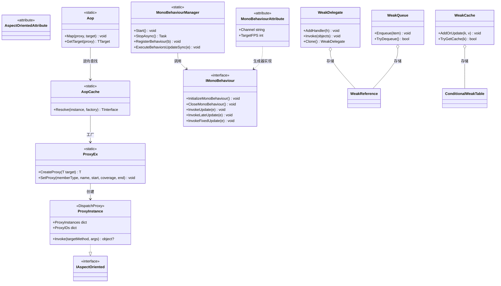

# 设计模式 — AOP、MonoBehaviour 与弱引用



## 1. 代理模式 — 基于 `DispatchProxy` 的 AOP

`ProxyEx.CreateProxy<T>` 把目标交给 `DispatchProxy.Create<T, ProxyInstance>()`，再把真实目标与类型记录到代理上：

```csharp
// Src/Core/VeloxDev.Core/AspectOriented/ProxyEx.cs（第 16-25 行）
public static T CreateProxy<T>(this T target) where T : IAspectOriented
{
    var type = typeof(T);
    dynamic proxy = DispatchProxy.Create<T, ProxyInstance>() ?? throw new InvalidOperationException();
    proxy._target = target;
    proxy._targetType = type;
    ProxyInstance.ProxyIDs.Add(proxy, proxy._localid);
    return proxy;
}
```

对代理的所有调用都汇入唯一的拦截点 `ProxyInstance.Invoke`。

## 2. 装饰器 / 拦截器 — start / coverage / end 钩子

`SetProxy` 把 `(start, coverage, end)` 三元组写入成员的钩子表。`ProxyInstance.Invoke` 通过 start →（coverage 或反射）→ end 装饰成员，并用 `previous` 串联返回值：

```csharp
// Src/Core/VeloxDev.Core/AspectOriented/ProxyInstance.cs（第 23-35 行）
protected override object? Invoke(MethodInfo? targetMethod, object?[]? args)
{
    var Name = targetMethod?.Name ?? string.Empty;
    if (Name == string.Empty) return null;
    if (Name.StartsWith("get_"))
    {
        GetterActions.TryGetValue(Name, out var actions);
        var R0 = actions?.Item1?.Invoke(args, null);
        var R1 = actions?.Item2 == null ? _targetType?.GetMethod(Name)?.Invoke(_target, args) : actions.Item2.Invoke(args, R0);
        actions?.Item3?.Invoke(args, R1);
        return R1;
    }
```

`coverage` 处理器非空时是**装饰器**：它接收 start 的结果 `R0`，其自身返回值 `R1` 成为成员的结果，从而绕开原逻辑。

## 3. 模板方法 — 生成的 MonoBehaviour 生命周期

生成器生成 `IMonoBehaviour` 桥接并声明 partial 钩子；用户在 partial 方法中填充 `Update` / `FixedUpdate` 步骤。循环骨架在管理器里，可变步骤在 partial 方法里：

```csharp
// Src/Generators/VeloxDev.Core.Generator/Writers/MonoWriter.cs（第 80-120 行，节选）
public void InvokeUpdate(VeloxDev.TimeLine.FrameEventArgs e)
{
    Update(e);
}
// ...
partial void Awake();
partial void Start();
partial void Update(VeloxDev.TimeLine.FrameEventArgs e);
partial void LateUpdate(VeloxDev.TimeLine.FrameEventArgs e);
partial void FixedUpdate(VeloxDev.TimeLine.FrameEventArgs e);
```

## 4. 观察者模式 — 生命周期 / 通道事件

`LoopChannel` 暴露 `Started` / `Paused` / `Resumed` / `Stopped`，并以 `MonoBehaviourChannelEventArgs` 转发到静态 `MonoBehaviourManager` 事件：

```csharp
// Src/Core/VeloxDev.Core/TimeLine/MonoBehaviourManager.cs（第 156-159、987-991 行）
public event EventHandler? Started;
public event EventHandler? Paused;
public event EventHandler? Resumed;
public event EventHandler? Stopped;
// ...
ch.Started += (s, e) => OnChannelStarted?.Invoke(s, new MonoBehaviourChannelEventArgs(n));
```

## 5. 享元 / 注册表 — 带 `ConditionalWeakTable` 的 `AopCache`

利用 CLR 泛型特化，为每一对 `(TClass, TInterface)` 提供一张共享的 `ConditionalWeakTable`，无需为每个类生成缓存代码。代理只创建一次，并随目标一起被 GC 回收：

```csharp
// Src/Core/VeloxDev.Core/AspectOriented/AopCache.cs（第 14-32 行）
private static class Entry<TClass, TInterface>
    where TClass : class
    where TInterface : class, IAspectOriented
{
    public static readonly ConditionalWeakTable<TClass, TInterface> Instances = [];
}
// ...
return Entry<TClass, TInterface>.Instances.GetValue(instance, k => factory(k));
```

## 6. 弱引用惯用法 — 弱引用（WeakTypes）

四个弱引用类型都存储 `WeakReference<T>`（或 `ConditionalWeakTable`）而非强引用，发布者 / 缓存不会持有订阅者 / 键的强引用：

```csharp
// Src/Core/VeloxDev.Core/WeakTypes/WeakQueue.cs（第 34-42 行）
public void Enqueue(T item)
{
    if (item == null) throw new ArgumentNullException(nameof(item));
    lock (_lock)
    {
        _references.Enqueue(new WeakReference<T>(item));
    }
}
```

`TryDequeue` / `TryPop` / `TryPeek` 跳过已死引用；`Count`、`GetEnumerator` 与 `TrimExcess` 会先 `Prune()` 已回收条目（`WeakQueue.cs` 第 124-135 行、`WeakStack.cs` 第 124-136 行）。

> 出处汇总：`Src/Core/VeloxDev.Core/AspectOriented/*.cs`、`Src/Core/VeloxDev.Core/TimeLine/*.cs`、`Src/Core/VeloxDev.Core/WeakTypes/*.cs`、`Src/Generators/VeloxDev.Core.Generator/Writers/{AopWriter,MonoWriter}.cs`、`Examples/AOP/WPF/Demo/MainWindow.xaml.cs`。
