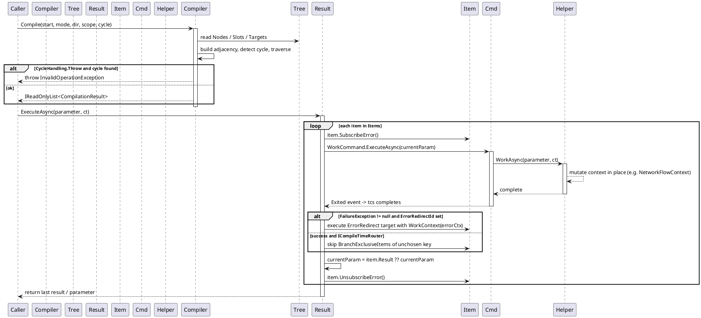
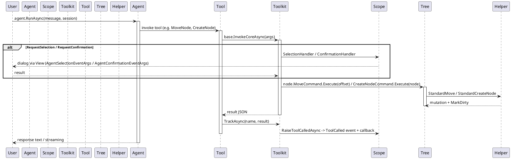

# 数据流 — 工作流系统

四个时序图追踪主要数据流。使用 PlantUML 语法，可在任意 PlantUML 服务器渲染。

## 1. CreateNode + 撤销 / 重做

`helper.CreateNode(node)` 汇入 `StandardCreateNode`，提交可撤销的 `WorkflowActionPair`。撤销和重做弹出栈并运行配对的操作。

```plantuml
@startuml
    participant Caller
    participant Helper as TreeHelper
    participant Tree as IWorkflowTreeViewModel
    participant Cache as TreeCache(UndoStack/RedoStack)
    participant Pair as WorkflowActionPair
    participant Node as IWorkflowNodeViewModel

    Caller -> Helper: CreateNode(node)
    activate Helper
    Helper -> Tree: StandardCreateNode(node)
    activate Tree
    Tree -> Node: GetHelper().Delete()
    Tree -> Tree: new WorkflowActionPair(redo, undo)
    Tree -> Cache: StandardSubmit(pair)
    activate Cache
    Cache -> Pair: pair.Redo.Invoke()
    activate Pair
    Pair -> Tree: redo: Nodes.Add(node); node.Parent = tree
    deactivate Pair
    Cache -> Cache: UndoStack.Push(pair)
    deactivate Cache
    deactivate Tree
    deactivate Helper

    Caller -> Tree: UndoCommand.Execute(null)
    activate Tree
    Tree -> Cache: StandardUndo()
    activate Cache
    Cache -> Cache: UndoStack.TryPop(out pair)
    Cache -> Pair: pair.Undo.Invoke()
    activate Pair
    Pair -> Tree: undo: Nodes.Remove(node); node.Parent = oldParent
    deactivate Pair
    Cache -> Cache: RedoStack.Push(pair)
    deactivate Cache
    deactivate Tree

    Caller -> Tree: RedoCommand.Execute(null)
    activate Tree
    Tree -> Cache: StandardRedo()
    activate Cache
    Cache -> Cache: RedoStack.TryPop(out pair)
    Cache -> Pair: pair.Redo.Invoke()
    activate Pair
    Pair -> Tree: redo: Nodes.Add(node); node.Parent = tree
    deactivate Pair
    Cache -> Cache: UndoStack.Push(pair)
    deactivate Cache
    deactivate Tree
@enduml
```

错误路径：若 `pair.Redo.Invoke()` 抛出异常，`StandardSubmit`/`StandardUndo`/`StandardRedo` 会捕获并通过 `Debug.WriteLine` 记录 —— 栈保持不变。

*源码：`Src/Core/VeloxDev.Core/WorkflowSystem/StandardEx/WorkflowTreeEx.cs`，第 27-35、181-234 行。*

## 2. SendConnection / ReceiveConnection

连接分两个阶段建立。`SendConnection(sender)` 检查发送端容量、显示虚拟连接并设置 `PreviewSender`。`ReceiveConnection(receiver)` 校验容量 + `ValidateConnection`、清理冲突的同向连接、创建连接，并把整个连接作为一个可撤销操作提交。

```plantuml
@startuml
    participant Caller
    participant Tree as IWorkflowTreeViewModel
    participant Sender as Slot(sender)
    participant Receiver as Slot(receiver)
    participant Link as IWorkflowLinkViewModel

    Caller -> Tree: SendConnectionCommand.Execute(sender)
    activate Tree
    Tree -> Sender: StandardCanBeSender()
    alt not canBeSender
        Tree -> Tree: ResetVirtualLink(); CurrentSender = null
    else canBeSender
        Tree -> Tree: SmartCleanupSenderConnections(sender)
        Tree -> Tree: VirtualLink.IsVisible = true
        Tree -> Sender: State = PreviewSender; UpdateState()
        Tree --> Caller: CurrentSender = sender
    end
    deactivate Tree

    Caller -> Tree: ReceiveConnectionCommand.Execute(receiver)
    activate Tree
    alt CurrentSender == null
        Tree --> Caller: return (no-op)
    else CurrentSender != null
        Tree -> Receiver: StandardCanBeReceiver()
        Tree -> Tree: GetHelper().ValidateConnection(CurrentSender, receiver)
        alt invalid (capacity / validation / same parent)
            Tree -> Tree: ResetVirtualLink(); CurrentSender = null
        else valid
            Tree -> Tree: CleanupSameDirectionConnections / SmartCleanupReceiver
            Tree -> Link: CreateLink(sender, receiver) via GetHelper()
            Tree -> Tree: StandardSubmit(WorkflowActionPair)
            Tree -> Tree: redo: LinksMap[sender][receiver] = link; Links.Add; Sender.Targets.Add; Receiver.Sources.Add
            Tree -> Tree: ResetVirtualLink(); CurrentSender = null
        end
    end
    deactivate Tree
@enduml
```

错误路径：任何校验失败（容量、自定义 `ValidateConnection`、同节点连接）都会重置虚拟连接且不建立连接；已有的同向连接通过提交的 `WorkflowActionPair` 被原子替换。

*源码：`Src/Core/VeloxDev.Core/WorkflowSystem/StandardEx/WorkflowTreeEx.cs`，第 92-177、363-416 行。*

## 3. Compile + ExecuteAsync 与 WorkCommand 生命周期

`WorkflowCompiler.Compile` 遍历图（BFS 或 DFS）并生成带 `Order`/`Depth` 的 `CompilationResult` 项目。`ExecuteAsync` 逐个项目派发 `WorkCommand`（fire-and-forget）并等待 `Exited` 事件，然后把参数转发给下一个项目。路由器分支通过 `BranchExclusiveItems` 跳过。



取消路径：循环顶部 `ct.ThrowIfCancellationRequested()` 会中止整条链；节点抛出的 `OperationCanceledException` 立即重抛。

*源码：`Src/Core/VeloxDev.Core/WorkflowSystem/Compilation/Compiler.cs`，第 54-149 行；`Models/CompilationResult.cs`，第 157-260 行；`Models/CompiledItem.cs`，第 104-121 行。*

## 4. Agent 工具调用流

聊天客户端驱动 `IAIAgent`。工具被调用时，`WorkflowAgentToolkit` 调用底层 `AIFunction`、追踪调用，工具通过 helper/命令变更树。交互工具（`RequestSelection` / `RequestConfirmation`）可暂停等待用户。



错误路径：`TrackedAIFunction.InvokeCoreAsync` 捕获异常并返回 JSON `{"error": "..."}` 而非抛出；达到 `MaxToolCalls` 后，后续调用返回 `"Tool call limit exceeded"`。

*源码：`Src/Core/VeloxDev.Core.Extension/Agent/Workflow/Functions/WorkflowAgentToolkit.cs`，第 146-195 行；`Workflow/WorkflowAgentScope.cs`，第 276-297 行。*
