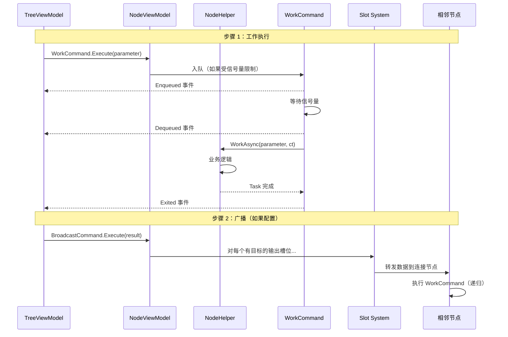
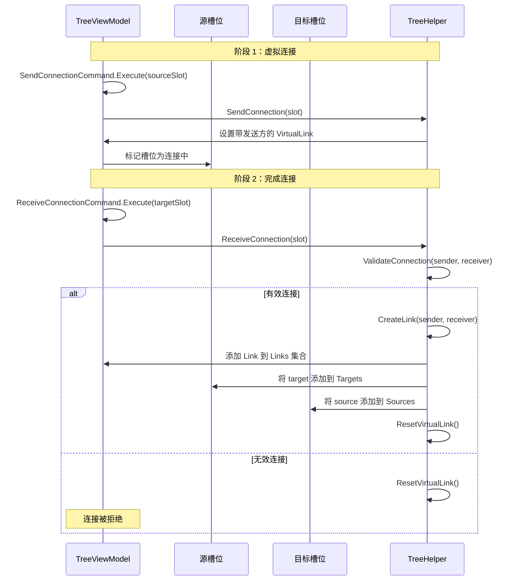
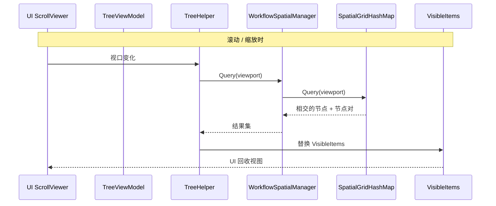
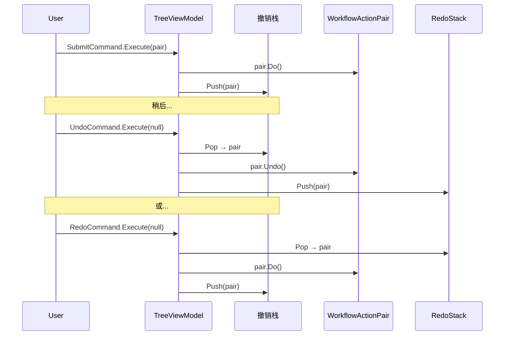
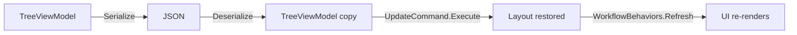

# 数据流 — 工作流系统

## 1. 节点工作执行流程

当节点的 `WorkCommand` 被触发时，执行以下序列：

## 2. 连接建立流程

## 3. 空间查询流程（视口裁剪）

## 4. 撤销/重做流程

## 5. 序列化流程

`VeloxDev.MVVM.Serialization` 命名空间提供 `Serialize()` 和 `Deserialize<T>()` 扩展方法。序列化保留完整的对象图：节点、槽位、连接线、布局状态和自定义数据属性。
