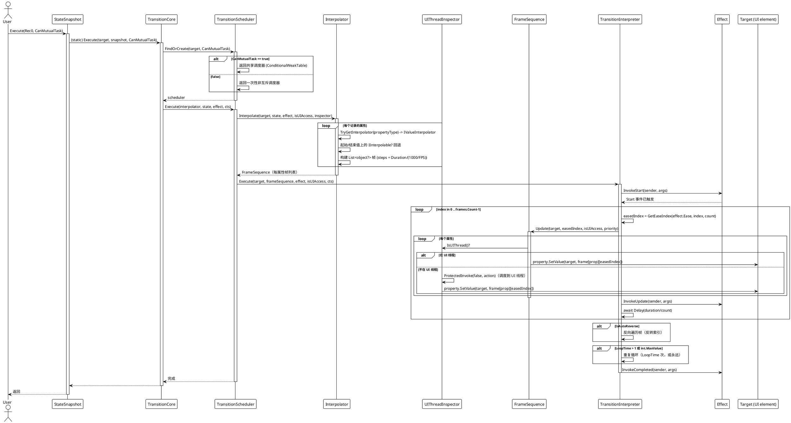
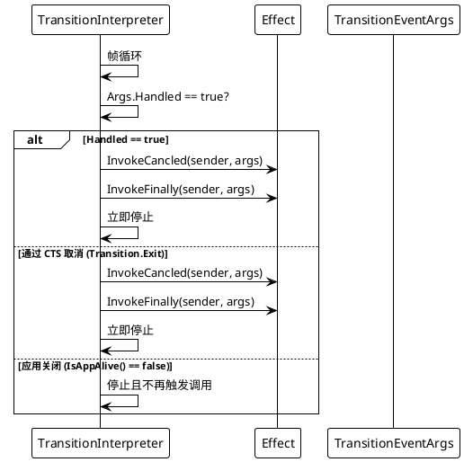

# 数据流 — 过渡动画系统

## 执行状态快照（`snapshot.Execute(target)`）

从 `Execute` 到帧泵的完整调用链。此流程在全部六个平台适配器上一致运行。

## 取消与异常路径

## 正常 / 异常路径总结

| 场景 | 行为 |
|---|---|
| 正常执行 | 帧在 UI 线程经 `UIThreadInspector` 应用；每帧触发 `Update`/`LateUpdate` 事件；结束时触发 `Completed` + `Finally`。 |
| 同目标新的互斥动画 | 新动画运行前，先前调度器被 `Exit()`（当前动画被取消）。 |
| `TransitionEventArgs.Handled = true` | 短路时间线；触发 `Canceled` + `Finally` 事件。 |
| `Transition.Exit(target)` | 取消目标的互斥（可选非互斥）调度器。 |
| 后台线程启动 | `UIThreadInspector.ProtectedInvoke(false, action)` 把帧写调度回 UI 线程。 |
| 属性无插值器 | 跳过该属性；其余属性照常动画。 |

> 源码引用：`Src/Core/VeloxDev.Core/TransitionSystem/TransitionInterpreter.cs`（帧泵）、`TransitionScheduler.cs`（`FindOrCreate`、`Execute`）、`Interpolator.cs`（解析）、`InterpolatorOutputCore.cs`（`Update`）、`Src/Adapters/*/PlatformAdapters/UIThreadInspector.cs`。
