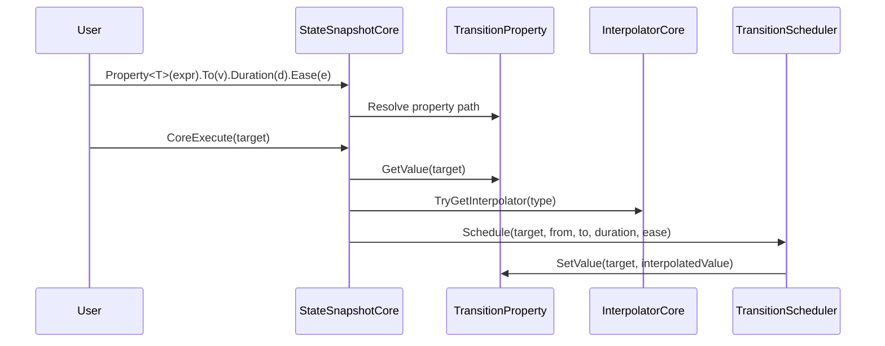
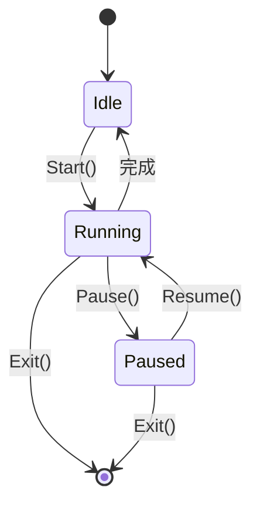

# 数据流 — 过渡动画系统

## 过渡执行流程

```mermaid
sequenceDiagram
	participant User
	participant Snap as StateSnapshotCore
	participant TP as TransitionProperty
	participant IC as InterpolatorCore
	participant Sch as TransitionScheduler

	User->>Snap: Property<T>(expr).To(v).Duration(d).Ease(e)
	Snap->>TP: Resolve property path
	User->>Snap: CoreExecute(target)
	Snap->>TP: GetValue(target)
	Snap->>IC: TryGetInterpolator(type)
	Snap->>Sch: Schedule(target, from, to, duration, ease)
	Sch->>TP: SetValue(target, interpolatedValue)
```

## 调度器状态

```mermaid
stateDiagram-v2
	[*] --> Idle
	Idle --> Running: Start()
	Running --> Paused: Pause()
	Paused --> Running: Resume()
	Running --> Idle: 完成
	Running --> [*]: Exit()
	Paused --> [*]: Exit()
```
