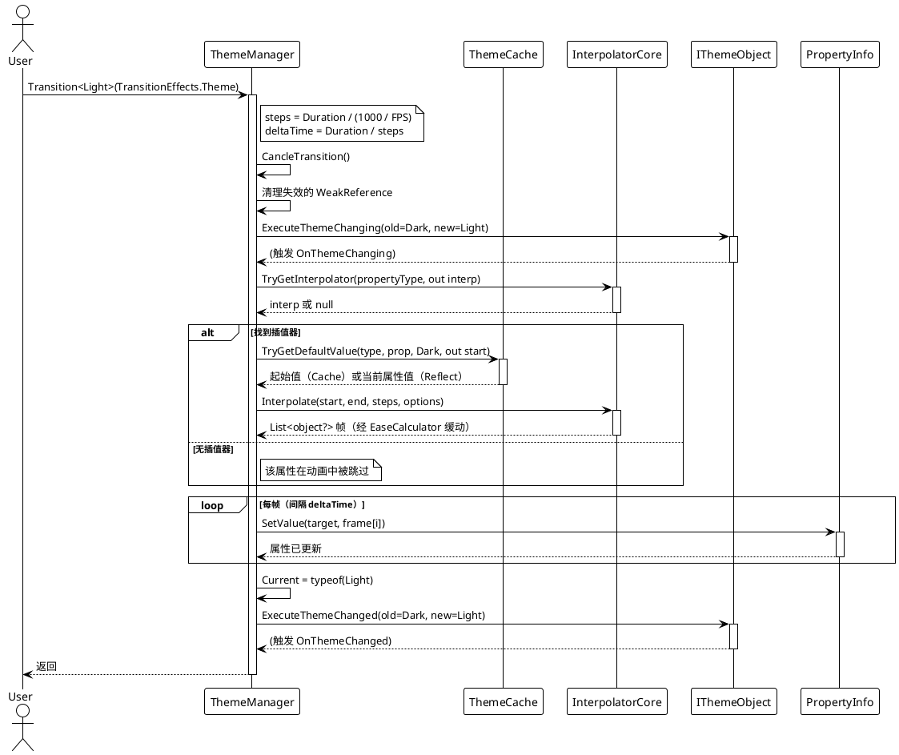
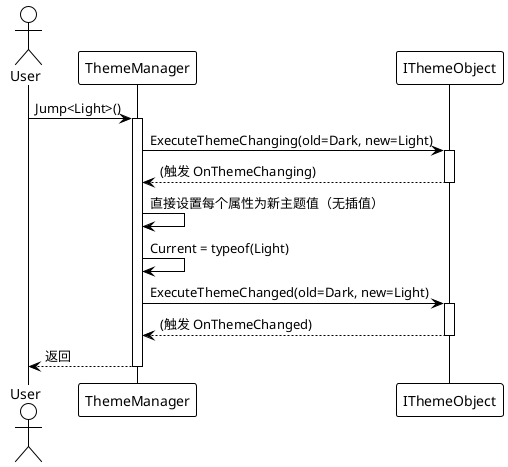
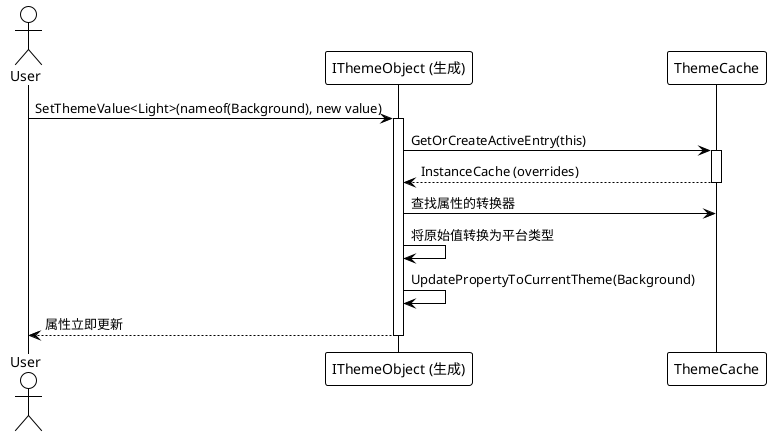

# 数据流 — 动态主题

## 带动画主题切换（`Transition<T>`）

核心 API 调用链。`ThemeManager.Transition` 预先计算所有插值帧，然后按帧定时应用到对象上。

## 即时切换（`Jump<T>`）

## 运行时值覆盖（`SetThemeValue<T>`）

## 正常路径与异常路径

| 场景 | 行为 |
|---|---|
| 正常动画切换 | 在 `Duration` 内对每个已注册对象的属性插值，然后设置 `Current` 并触发 `OnThemeChanged`。 |
| `themeType == Current` | 提前终止 — 调试信息「Invalid theme type, jumping to current theme.」 |
| `themeType` 不实现 `ITheme` | 同样提前终止。 |
| 属性无插值器 | 动画中跳过该属性；仍由 `Jump`/`SetThemeValue` 设置为最终值。 |
| `steps <= 0`（零时长效果） | 钳制为 `steps = 1`，主题仍会应用。 |

> 源码引用：`Src/Core/VeloxDev.Core/DynamicTheme/ThemeManager.cs`（第 83–106 行 `Transition`、153–407 行 `CalculateFrames`、414–452 行 `ExecuteTransition`）、`Src/Generators/VeloxDev.Core.Generator/Theme.cs`。
