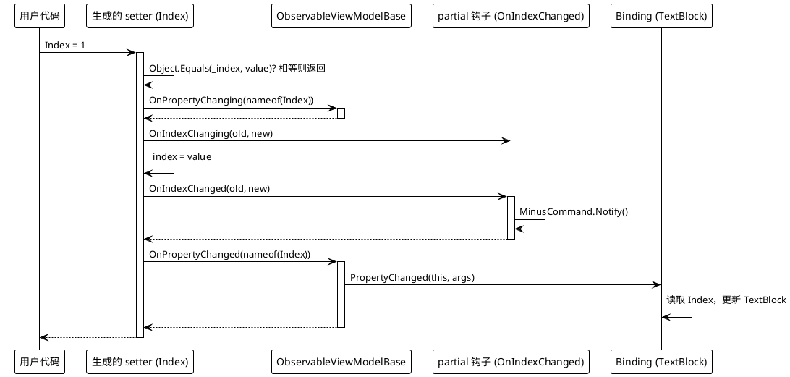
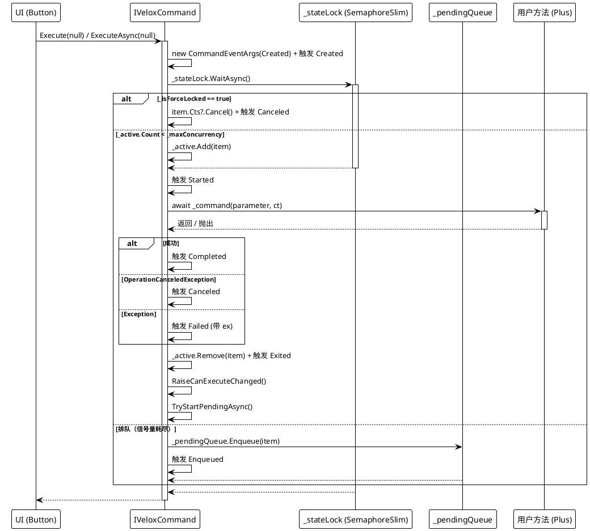
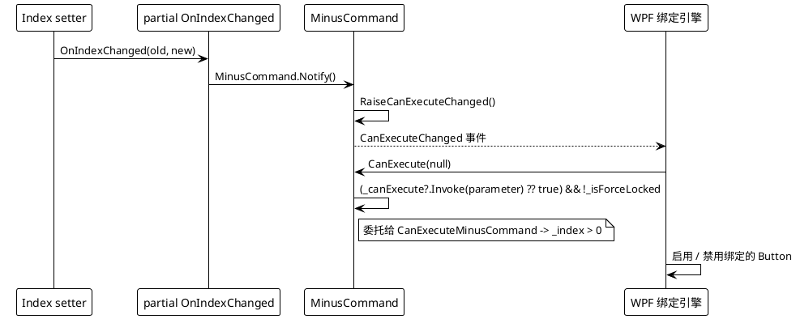

# 数据流 — MVVM

## （a）设置 `[VeloxProperty]` 字段

生成的 setter（默认模式）触发变更通知并转发到 partial 钩子。setter 行来源：`Src/Generators/VeloxDev.Core.Generator/Base/Analizer.cs`，`GetSetterBodyLines`，第 287-307 行。

## （b）执行 `[VeloxCommand]`

经过 `ExecuteAsync` → 信号量 / 队列 → 生命周期事件的流程（VeloxCommand.cs，第 139-174、176-204、206-222 行）。

## （c）`Notify()` 触发的 CanExecute 流程

## 错误 / 并发路径总结

| 场景 | 行为 |
|---|---|
| 强制锁定时触发（`Lock()`） | `ExecuteAsync` 取消新条目并触发 `Canceled`；不开始执行。 |
| 容量耗尽（`_active.Count == _maxConcurrency`） | 条目入队并触发 `Enqueued`；当容量释放或执行 `UnLock` / `Continue` / `ChangeSemaphore` 后，`TryStartPendingAsync` 出队（触发 `Dequeued`）。 |
| 用户方法抛出异常 | 触发 `Failed`（`CommandEventArgs.Exception`）；`Exited` 仍会触发。 |
| `OperationCanceledException` | 触发 `Canceled`。 |
| `Interrupt()` | 取消活动 CTS，随后 `UnLockAsync` 重新允许触发。 |
| `Clear()` | 取消活动并出队所有待处理项，对每个条目触发 `Dequeued` 再触发 `Canceled`。 |

> 源引用：`Src/Core/VeloxDev.Core/MVVM/VeloxCommand.cs`（`ExecuteAsync`、`ExecuteCoreAsync`、`OnExecutionCompletedAsync`、`TryStartPendingAsync`、`InterruptAsync`、`ClearAsync`）、`Src/Generators/VeloxDev.Core.Generator/Base/Analizer.cs`（`GetSetterBodyLines`、`GenerateCollectionMembers`）、`Examples/MVVM/WPF/Demo/MainWindowViewModel.cs`。
