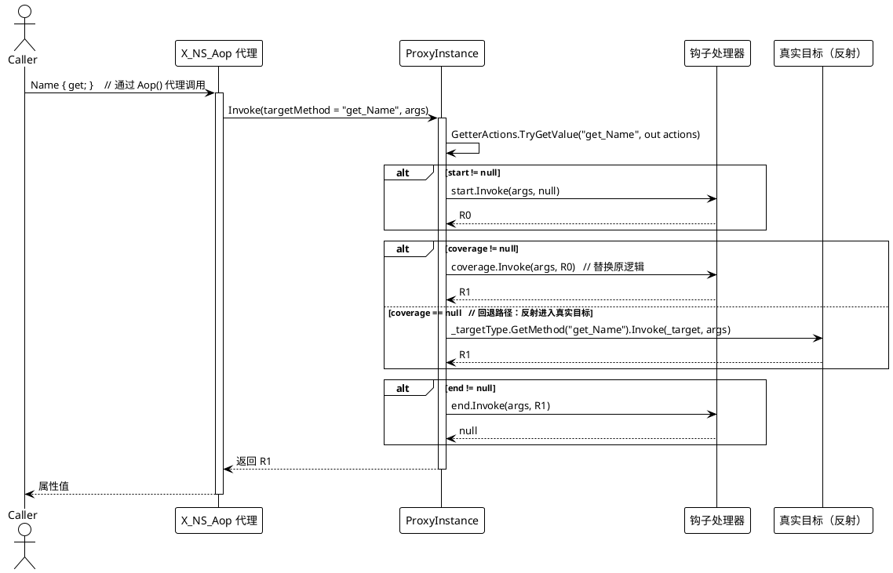
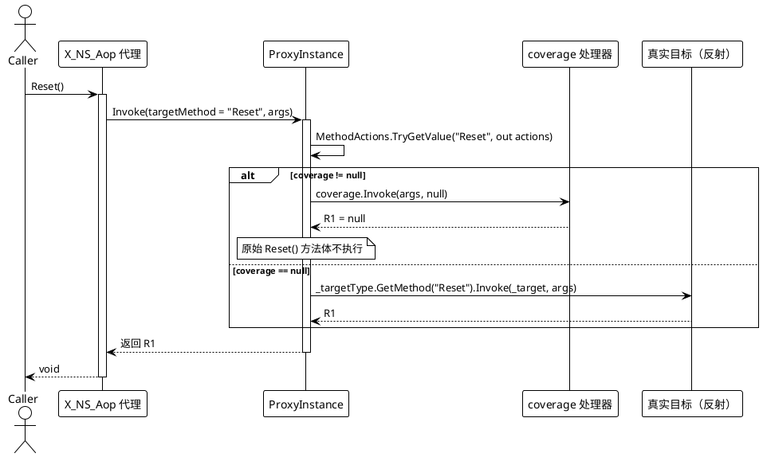
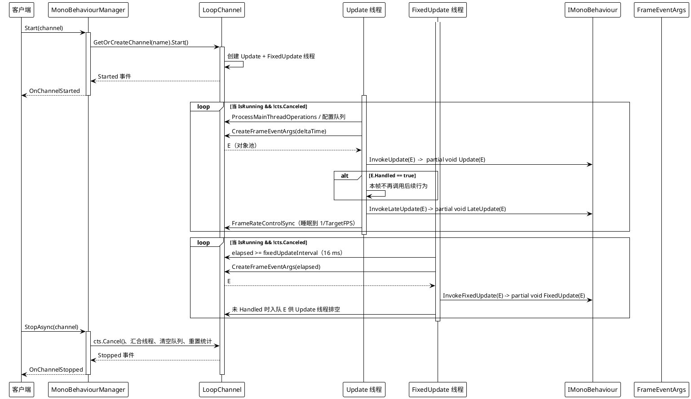
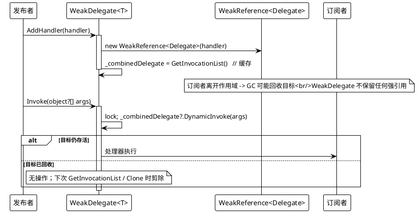

# 数据流 — AOP、MonoBehaviour 与弱引用

## 1. AOP 属性读取（getter + start 钩子）

`set_*`（写入 `SetterActions`）与普通方法（写入 `MethodActions`）形状相同。`coverage` 为 `null` 时总是回退到 `_targetType.GetMethod(Name)?.Invoke(_target, args)`（`ProxyInstance.cs` 第 23-53 行）。

## 2. AOP 方法调用（coverage 覆写）

demo 接线：`p.SetProxy(ProxyMembers.Method, nameof(TeamViewModel.Reset), null, coverage, null)` 取消默认的 `Reset()`（`Examples/AOP/WPF/Demo/MainWindow.xaml.cs` 第 63-68 行）。

## 3. MonoBehaviour 帧循环

关键循环源码：`MonoBehaviourManager.cs` 第 394-441 行（`FixedUpdateLoop`）、443-488 行（`UpdateLoop`）、610-656 行（`ExecuteBehaviorsUpdateSync` / `LateUpdate` / `FixedUpdate`）、245-291 行（`Start`）、293-336 行（`StopAsync`）。

## 4. WeakDelegate — 添加 + 调用

出处：`WeakDelegate.cs` 第 10-17 行（`AddHandler`）、35-55 行（`GetInvocationList`）、57-66 行（`CleanupCollectedHandlers`）、68-74 行（`Invoke`）、76-91 行（`Clone`）。
