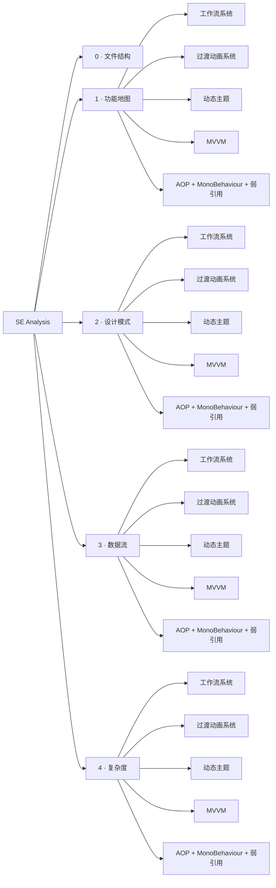

# 软件工程分析

本节从五个固定维度分析 VeloxDev 架构。每个维度再按**功能**划分（工作流系统、过渡动画系统、动态主题、MVVM、AOP + MonoBehaviour + 弱引用），与发现阶段建立的 Feature Inventory 一致。

| 维度 | 描述 |
|---|---|
| [文件结构](0_文件结构) | 仓库布局、项目到目录映射、Mermaid 流程图 |
| [功能地图](1_功能地图) | 模块职责边界、功能 → 项目 → 依赖映射 |
| [设计模式](2_设计模式) | 各功能使用的模式（命令、模板方法、代理、注册表...） |
| [数据流](3_数据流) | 各功能核心 API 调用链的 PlantUML 时序图 |
| [复杂度](4_复杂度) | 各功能核心操作的 KaTeX 时间/空间复杂度 |

## 功能索引

| 功能 | 所属项目 | 证据 |
|---|---|---|
| 工作流系统（+ Agent / AI / MCP） | `VeloxDev.Core` + `VeloxDev.Core.Extension` | Demo（`Examples/Workflow`）+ Test |
| 过渡动画系统 | `VeloxDev.Core` + 适配器 | Demo（`Examples/Transition`，6 平台）+ Test |
| 动态主题 | `VeloxDev.Core` + 适配器 | Demo（`Examples/Theme`）+ Test |
| MVVM | `VeloxDev.Core` + `VeloxDev.Core.Generator` | Demo（`Examples/MVVM`）+ Test |
| AOP + MonoBehaviour + 弱引用 | `VeloxDev.Core` | Demo（`Examples/AOP`、`Examples/MonoBehaviour`）+ Test |
